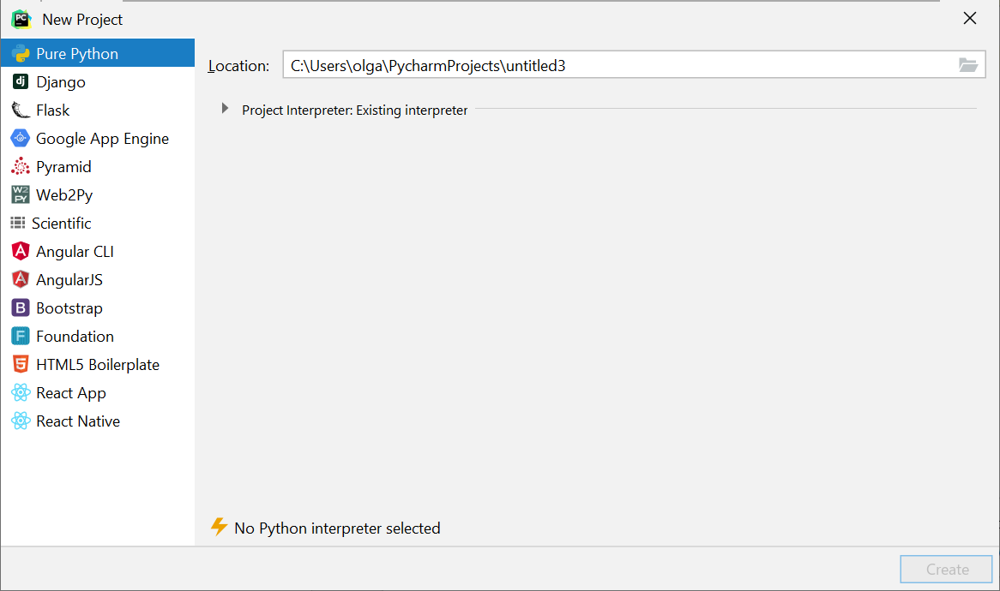
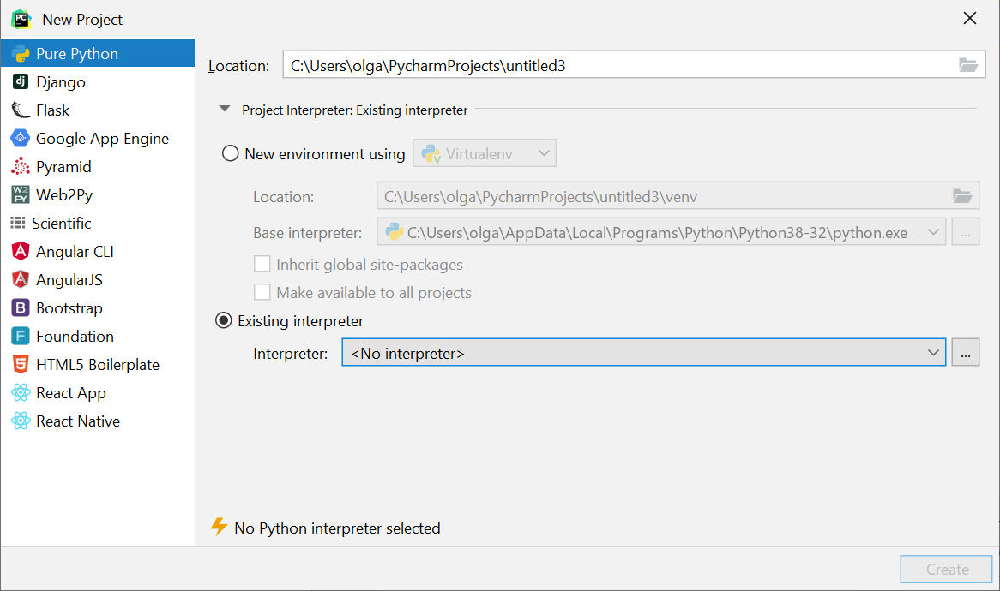
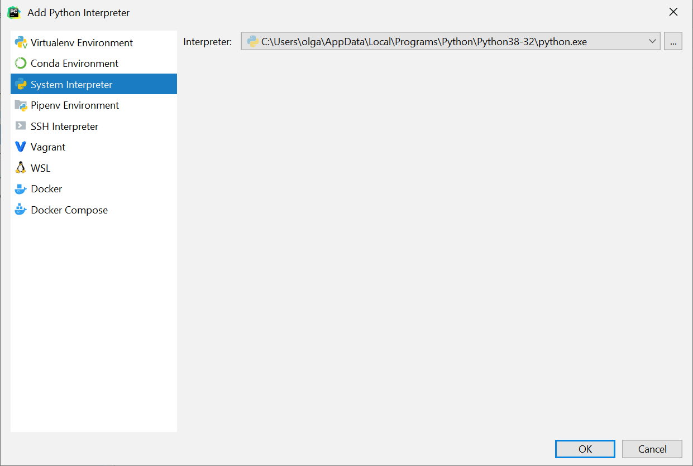
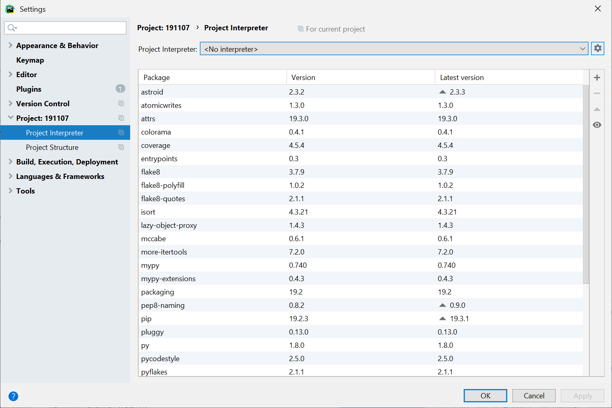

## Запуск Python из консоли

Запустить питоновский скрипт из консоли: 

`python hello_world.py` -- для Windows,

`python3 hello_world.py` -- для Linux и macOS

Вместо `hello_world.py` можно подставить имя любого скрипта.

## PyCharm: настройка интерпретатора

При создании проекта в PyCharm нужно указать правильный интерпретатор. Для этого нажимаем *Project Interpreter: Existing interpreter*



(рис. 1)

Дальше выбираем *Existing interpreter* и нажимаем на три точки слева.



(рис. 2)

Появляется такое окошко. Выбираем *System Interpreter* и находим интерпретатор в файловой системе. На Windows это что-то вроде *C:\Users\olga\AppData\Local\Programs\Python\Python38-32\python.exe*, в macOS -- что-то вроде */usr/bin/python3.7* или */usr/local/bin/python3.7*.



 (рис. 3)

Также можно настроить интерпретатор в уже существующем проекте. Для этого выбираем *File > Settings* в Windows/Linux или *Pycharm > Preferences* в macOS. Дальше выбираем *Project > Project Interpreter*, нажимаем на значок настроек справа и попадаем в окошко для выбора интерпретатора (см. рис. 3).



## Статические анализаторы

Статические анализаторы или линтеры анализируют файлы с исходным кодом, не запуская при этом сам код. 

## Функция to_lowercase(l)

### Решение в лоб

```python
def to_lowercase(l):
    res = []
    for s in l:
        res.append(s)
    return res
```


### List comprehension

```python
def to_lowercase(l):
    return [s.lower() for s in l]
```

### Map

```python
def to_lowercase(l):
    return list(map(lambda s: s.lower(), l))
```

